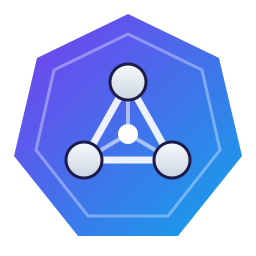

<div align="center">



# Qdrant Operator

**A Kubernetes operator for managing Qdrant vector database clusters**

[](https://github.com/4thel00z/qdrant-operator/actions/workflows/ci.yml)
[](https://pypi.org/project/qdrant-operator/)
[](https://www.python.org/downloads/)
[](https://opensource.org/licenses/MIT)
[](https://kubernetes.io/)

[Features](#features) •
[Installation](#installation) •
[Usage](#usage) •
[Configuration](#configuration) •

</div>

---

## Features

- **Cluster Management** - Deploy and manage Qdrant clusters via Helm
- **Automated Backups** - Per-node snapshots streamed to S3-compatible storage, with a manifest
- **Scheduled Backups** - CronJob-style schedules with concurrency and retention policies
- **Disaster Recovery** - Restore collections node-by-node from presigned URLs, with optional remapping
- **Async-First** - Built on kopf with fully async adapters for performance

## Installation

### Prerequisites

- Kubernetes cluster (v1.26+)
- Helm 3.x installed
- kubectl configured with cluster access

### Install with Helm (Recommended)

```bash
# From the OCI registry (published on every release)
helm install qdrant-operator oci://ghcr.io/4thel00z/charts/qdrant-operator -n qdrant-system --create-namespace

# Or from the local chart
helm install qdrant-operator ./charts/qdrant-operator

# Or install in a specific namespace
helm install qdrant-operator ./charts/qdrant-operator -n qdrant-system --create-namespace

# Verify installation
kubectl get pods -l app.kubernetes.io/name=qdrant-operator
```

### Configuration

Override default values:

```bash
helm install qdrant-operator ./charts/qdrant-operator \
  --set operator.logLevel=DEBUG \
  --set resources.limits.memory=512Mi
```

Or use a values file:

```bash
helm install qdrant-operator ./charts/qdrant-operator -f my-values.yaml
```

### Install from PyPI
The operator is also a Python package; the `qdrant-operator` command runs it against your kubeconfig,
forwarding any extra flags to `kopf run` (for example `--namespace team-a`).
```bash
uv tool install qdrant-operator   # or: pipx install qdrant-operator
qdrant-operator --help
```
Container images: `ghcr.io/4thel00z/qdrant-operator:<version>` (linux/amd64, linux/arm64, signed provenance).
### Build Docker Image (Optional)

```bash
# Replace with your registry
docker build -t ghcr.io/YOUR_ORG/qdrant-operator:0.1.0 .
docker push ghcr.io/YOUR_ORG/qdrant-operator:0.1.0
```

### Local Development

```bash
# Install dependencies
uv sync

# Apply CRDs to cluster
kubectl apply -f manifests/crds/

# Run operator locally against your kubeconfig
make dev
```

## Usage

### Create a Qdrant Cluster

```yaml
apiVersion: qdrant.io/v1alpha1
kind: QdrantCluster
metadata:
  name: my-qdrant
  namespace: default
spec:
  replicas: 3
  version: v1.16.3
  resources:
    requests:
      cpu: "500m"
      memory: "1Gi"
    limits:
      cpu: "2"
      memory: "4Gi"
  persistence:
    size: 10Gi
    storageClassName: standard
  cluster:
    enabled: true
```

### Create a Backup

```yaml
apiVersion: qdrant.io/v1alpha1
kind: QdrantBackup
metadata:
  name: my-backup
  namespace: default
spec:
  clusterRef:
    name: my-qdrant
  storage:
    s3:
      bucket: my-backups
      prefix: qdrant
      region: us-east-1
      credentialsSecretRef:
        name: s3-credentials
        accessKeyIdKey: AWS_ACCESS_KEY_ID
```

### Schedule Automated Backups

```yaml
apiVersion: qdrant.io/v1alpha1
kind: QdrantBackupSchedule
metadata:
  name: daily-backup
  namespace: default
spec:
  schedule: "0 2 * * *"  # Daily at 2 AM
  clusterRef:
    name: my-qdrant
  storage:
    s3:
      bucket: my-backups
      prefix: scheduled
      region: us-east-1
      credentialsSecretRef:
        name: s3-credentials
        accessKeyIdKey: AWS_ACCESS_KEY_ID
  retentionPolicy:
    keepLast: 7
    keepDaily: 30
  concurrencyPolicy: Forbid
```

### Restore from Backup

```yaml
apiVersion: qdrant.io/v1alpha1
kind: QdrantRestore
metadata:
  name: my-restore
  namespace: default
spec:
  backupRef:
    name: my-backup
  targetClusterRef:
    name: my-qdrant-new
  collectionMapping:
    old_collection: new_collection
```

## Configuration

### Environment Variables

| Variable | Description | Default |
|----------|-------------|---------|
| `KUBECONFIG` | Path to kubeconfig file | In-cluster config |
| `LOG_LEVEL` | Logging level | `INFO` |
| `LOG_FORMAT` | `json` or `text` | `json` |

### S3 Credentials Secret

```yaml
apiVersion: v1
kind: Secret
metadata:
  name: s3-credentials
type: Opaque
stringData:
  AWS_ACCESS_KEY_ID: "your-access-key"
  AWS_SECRET_ACCESS_KEY: "your-secret-key"
```

## Development

```bash
# Install dependencies
uv sync

# Run tests
uv run pytest

# Run integration tests (requires k8s cluster + helm)
make test-integration

# Lint and format
uv run ruff check src tests
uv run ruff format src tests

# Type checking
uv run pyright src tests
```

## Releasing
CI (`.github/workflows/ci.yml`) runs lint, pyright, unit tests, chart lint, a wheel/image build and the
kind-based end-to-end suite on every push and pull request.

Releases are driven by [release-please](https://github.com/googleapis/release-please) from the
conventional commit history: every push to `main` maintains a release PR that bumps
`pyproject.toml`, `Chart.yaml`, refreshes `uv.lock` and updates `CHANGELOG.md`. Merging that PR
creates the `vX.Y.Z` tag and the GitHub release; `release.yml` then publishes the wheel and sdist to
PyPI (trusted publishing, no token), pushes the multi-arch image and the Helm chart to ghcr.io, and
attaches the artifacts and CRDs to the release.

The workflow needs a `RELEASE_PLEASE_TOKEN` repository secret (a fine-grained PAT with *Contents*
and *Pull requests* read/write), because tags pushed with the default `GITHUB_TOKEN` do not trigger
other workflows.
## License

MIT License - see [LICENSE](LICENSE) for details.
